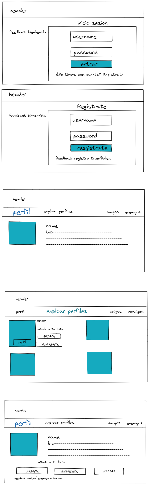

# Data Layer

## Data

- UsersContext
  - Users list
    - Friends list
    - Enemies list
  - User profile:
    - Name
    - ID
    - Image
    - Bio(info the user opcional)
    - Array of friends
    - Array of enemies
- UIContext
  - isLoading
  - isError
  - isAdded
  - isDeleted
  - isFriend
  - isEnemy

## Receive interactions

- UsersContext
  - loadUsers - Array of users
  - addFriend - Add user to the array of friends users
  - addEnemy - Add user to the array of enemies users
  - removeFriend - Remove user from the array of friend users
  - remoseEnemy - Remove user from the array of friends users
  - editUser - Update the user profile
  - registerUser - Add new user to database
- UiContext
  - setIsLoadingTrue
  - setIsLoadingFalse
  - setIsErrorTrue
  - setIsErrorFalse
  - setIsAdded
  - setIsDeleted
  - setIsFriend
  - setIsEnemy

# Components

## APP

### Show data

- Header component
- Nav-bar
- LoginPage before user
- Link RegisterPage
- HomePage when user is logged in
- FormPage when user wants to update profile
- NotFoundPage when user tries to navigate to unknown path
- Loading component while loading pages
- Modal to show feedback and error messages

## LoginPage

### Show data

- Form component with inputs:
  - Username
  - Password
  - Image
- Button component with “entrar” text
- Link to RegisterPage "¿No tienes una cuenta? Regístrate"

### Receive interactions

- Submit form on click
- Navigate ro RegisterPage on click

###

## RegisterPage

### Show data

- Form component with inputs:
  - Username
  - Password
  - Image
  - Button component with “Registrate” text
- Link to loginPage

### Receive interactions

- Submit form on click
- Navigate to loginPage on click

## HomePage

### Show data

- Heading level 2 with text “InstaFake”
- Nav-var
- usersList component

##

## UsersList

### Show data

- A userCard component for each user in the list

## Nav-bar

### Show data

- link :
  - friends
  - enemies”
  - explorar amigos
  - perfil

### Receive interactions

- Navigate roPages on click

## UserCard

### Show data

- Username
- image
- Bio ( text)
- Radio button with 3 options:
  - Deleted
  - Friend
  - Enemy

### Receive interactions

- Toggle relationship status on selection

### Receive interactions

- Toggle relationship status on selection

## NotFoundPage

### Show data

- Heading level 1 component with text “404 not found page”
- Link to LoginPage or Homepage

### Receive interactions

- Navigate to LoginPage or HomePage on click

## Button

### Show data

- Show the text received inside the button.

### Get actions

- Call the received action on click.

# InstaFakes

###

###

